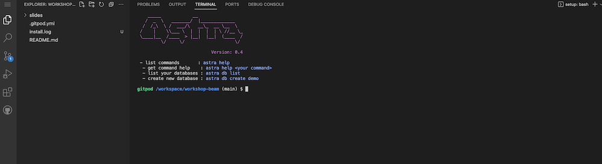
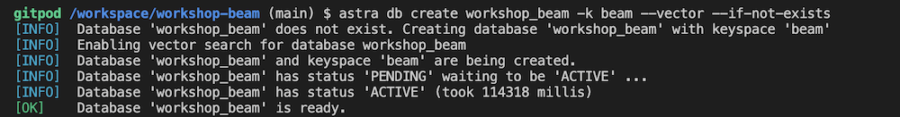
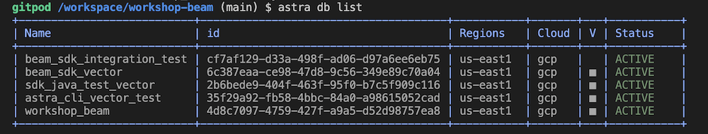
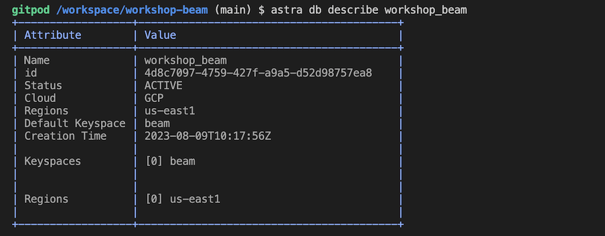

<!--- STARTEXCLUDE --->
# Workshop Apache Beam and Google DataFlow

[](https://gitpod.io/#https://github.com/datastaxdevs/workshop-beam)
[](http://www.apache.org/licenses/LICENSE-2.0)
[](https://discord.com/widget?id=685554030159593522&theme=dark)


## 📋 Table of content


[**HouseKeeping**](#housekeeping)
- [Objectives](#objectives)
- [Frequently asked questions](#frequently-asked-questions)
- [Materials for the Session](#materials-for-the-session)

[**LAB**](#1-database-initialization)
- [01. Create Astra Account](#-1---create-your-datastax-astra-account)
- [02. Create Astra Token](#-2---create-an-astra-token)
- [03. Copy the token](#-3---copy-the-token-value-in-your-clipboard)
- [04. Open Gitpod](#-4---open-gitpod)
- [05. Setup CLI](#-5---set-up-the-cli-with-your-token)
- [06. Create Database](#-6---create-destination-database-and-a-keyspace)
- [07. Create Destination Table](#-7---create-destination-table)
- [08. Setup env variables](#-8---setup-env-variables)
- [09. Setup Project](#-9---setup-project)
- [10. Run Importing Flow](#-10---run-importing-flow)
- [11. Validate Data](#-11---validate-data)

[**WalkThrough**](#walkthrough)
- [01. Compute Embeddings](#-1-run-flow-compute)
- [02. Show results](#-2-validate-output)
- [03. Create Google Project](#)
- [03. Create Google Project](#)

----
## HouseKeeping

### Objectives

* Introduce AstraDB and Vector Search capability
* Give you an first understanding about Apache Beam and Google DataFlow
* Discover NoSQL dsitributed databases and specially Apache Cassandra™.
* Getting familiar with a few Google Cloud Platform services

### Frequently asked questions

<p/>
<details>
<summary><b> 1️⃣ Can I run this workshop on my computer?</b></summary>
<hr>
<p>There is nothing preventing you from running the workshop on your own machine, If you do so, you will need the following
<ol>
<li><b>git</b> installed on your local system
<li><b>Java</b> installed on your local system
<li><b>Maven</b> installed on your local system
</ol>
</p>
In this readme, we try to provide instructions for local development as well - but keep in mind that the main focus is development on Gitpod, hence <strong>We can't guarantee live support</strong> about local development in order to keep on track with the schedule. However, we will do our best to give you the info you need to succeed.
</details>
<p/>
<details>
<summary><b> 2️⃣ What other prerequisites are required?</b></summary>
<hr>
<ul>
<li>You will need an enough *real estate* on screen, we will ask you to open a few windows and it does not file mobiles (tablets should be OK)
<li>You will need a GitHub account eventually a google account for the Google Authentication (optional)
<li>You will need an Astra account: don't worry, we'll work through that in the following
<li>As Intermediate level we expect you to know what java and maven are
</ul>
</p>
</details>
<p/>
<details>
<summary><b> 3️⃣ Do I need to pay for anything for this workshop?</b></summary>
<hr>
<b>No.</b> All tools and services we provide here are FREE. FREE not only during the session but also after.
</details>
<p/>
<details>
<summary><b> 4️⃣ Will I get a certificate if I attend this workshop?</b></summary>
<hr>
Attending the session is not enough. You need to complete the homeworks detailed below and you will get a nice badge that you can share on linkedin or anywhere else *(open api badge)*
</details>
<p/>

### Materials for the Session

It doesn't matter if you join our workshop live or you prefer to work at your own pace,
we have you covered. In this repository, you'll find everything you need for this workshop:

- [Slide deck](/slides/slides.pdf)
- [Discord chat](https://dtsx.io/discord)

----

## LAB

#### ✅ `1` - Create your DataStax Astra account

> ℹ️ Account creation tutorial is available in [awesome astra](https://awesome-astra.github.io/docs/pages/astra/create-account/)


_click the image below or go to [https://astra.datastax./com](bit.ly/3QxhO6t)_

<a href="bit.ly/3QxhO6t">

</a>
<br/>


#### ✅ `2` - Create an Astra Token

> ℹ️ Token creation tutorial is available in [awesome astra](https://awesome-astra.github.io/docs/pages/astra/create-token/#c-procedure)

- `Locate `Settings` (#1) in the menu on the left, then `Token Management` (#2) 

- Select the role `Organization Administrator` before clicking `[Generate Token]`


The Token is in fact three separate strings: a `Client ID`, a `Client Secret` and the `token` proper. You will need some of these strings to access the database, depending on the type of access you plan. Although the Client ID, strictly speaking, is not a secret, you should regard this whole object as a secret and make sure not to share it inadvertently (e.g. committing it to a Git repository) as it grants access to your databases.

```json
{
  "ClientId": "ROkiiDZdvPOvHRSgoZtyAapp",
  "ClientSecret": "fakedfaked",
  "Token":"AstraCS:fake"
}
```

#### ✅ `3` - Copy the token value in your clipboard

You can also leave the windo open to copy the value in a second.

#### ✅ `4` - Open Gitpod

> 
> ↗️ _Right Click and select open as a new Tab..._
>
> [](https://gitpod.io/#https://github.com/datastaxdevs/workshop-beam)
> 





#### ✅ `5` - Set up the CLI with your token

_In gitpod, in a terminal window:_

- Login

```bash
astra login --token AstraCS:fake
```

- Validate your are setup

```bash
astra org
```

> **Output**
> ```
> gitpod /workspace/workshop-beam (main) $ astra org
> +----------------+-----------------------------------------+
> | Attribute      | Value                                   |
> +----------------+-----------------------------------------+
> | Name           | cedrick.lunven@datastax.com             |
> | id             | f9460f14-9879-4ebe-83f2-48d3f3dce13c    |
> +----------------+-----------------------------------------+
> ```


#### ✅ `6` - Create destination Database and a keyspace

> ℹ️ You can notice we enabled the Vector Search capability 

- Create db `workshop_beam` and wait for the DB to become active

```
astra db create workshop_beam -k beam --vector --if-not-exists
```

> 💻 Output
> 
> 

- List databases

```
astra db list
```

> 💻 Output
> 
> 

- Describe your db

```
astra db describe workshop_beam
```

> 💻 Output
> 
> 

#### ✅ `7` - Create Destination table

- Create Table:

```bash
astra db cqlsh workshop_beam -k beam \
  -e  "CREATE TABLE IF NOT EXISTS fable(document_id TEXT PRIMARY KEY, title TEXT, document TEXT)"
```

- Show Table:

```bash
astra db cqlsh workshop_beam -k beam -e "SELECT * FROM  fable"
```

#### ✅ `8` - Setup env variables

- Create `.env` file with variables

```bash
astra db create-dotenv workshop_beam 
```

- Display the file

```bash
cat .env
```

- Load env variables

```
set -a
source .env
set +a
env | grep ASTRA
```

#### ✅ `9` - Setup project

This command will allows to validate that Java , maven and lombok are working as expected

```
mvn clean compile
```

#### ✅ `10` - Run Importing flow

- Open the CSV. It is very short and simple for demo purpose (and open API prices laters :) ).

```bash
/workspace/workshop-beam/samples-beam/src/main/resources/fables_of_fontaine.csv
```

- Open the Java file with the code

```bash
gp open /workspace/workshop-beam/samples-beam/src/main/java/com/datastax/astra/beam/genai/GenAI_01_ImportData.java
```


- Run the Flow

```
cd samples-beam
mvn clean compile exec:java \
 -Dexec.mainClass=com.datastax.astra.beam.genai.GenAI_01_ImportData \
 -Dexec.args="\
 --astraToken=${ASTRA_DB_APPLICATION_TOKEN} \
 --astraSecureConnectBundle=${ASTRA_DB_SECURE_BUNDLE_PATH} \
 --astraKeyspace=${ASTRA_DB_KEYSPACE} \
 --csvInput=`pwd`/src/main/resources/fables_of_fontaine.csv"
 ```

 #### ✅ `11` - Validate Data

 ```bash
astra db cqlsh workshop_beam -k beam -e "SELECT * FROM  fable"
```

----

## WalkThrough


We will now compute the embedding leveraging OpenAPI. It is not free, you need to provide your credit card to access the API. This part is a walkthrough. If you have an openAI key follow with me !


- [Access OpenAI interface and create a key](https://platform.openai.com/account/api-keys)

- [Learn more about the Embeddings API](https://platform.openai.com/docs/api-reference/embeddings)

- [Leanr More about the third party library in use](https://platform.openai.com/docs/libraries/community-libraries)


 #### ✅ `1` Run Flow Compute

- Setup Open AI

```
export OPENAI_API_KEY="<your_api_key>"
```

- Open the Java file with the code

```bash
gp open /workspace/workshop-beam/samples-beam/src/main/java/com/datastax/astra/beam/genai/GenAI_02_CreateEmbeddings.java
```

- Run the flow
```
mvn clean compile exec:java \
 -Dexec.mainClass=com.datastax.astra.beam.genai.GenAI_02_CreateEmbeddings \
 -Dexec.args="\
 --astraToken=${ASTRA_DB_APPLICATION_TOKEN} \
 --astraSecureConnectBundle=${ASTRA_DB_SECURE_BUNDLE_PATH} \
 --astraKeyspace=${ASTRA_DB_KEYSPACE} \
 --openAiKey=${OPENAI_API_KEY} \
 --table=fable"
```

 #### ✅ `2` Validate Output

```bash
astra db cqlsh workshop_beam -k beam -e "SELECT * FROM  fable"
```

 #### ✅ `3` Create Google Project 

 

- Create GCP Project

> Note: If you don't plan to keep the resources that you create in this guide, create a project instead of selecting an existing project. After you finish these steps, you can delete the project, removing all resources associated with the project. Create a new Project in Google Cloud Console or select an existing one.

In the Google Cloud console, on the project selector page, select or [create a Google Cloud project](https://cloud.google.com/resource-manager/docs/creating-managing-projects)

#### ✅ `4` Enable Billing 

Make sure that billing is enabled for your Cloud project. Learn how to [check if billing is enabled on a project](https://cloud.google.com/billing/docs/how-to/verify-billing-enabled)

#### ✅ `5` Save project ID: 

_The project identifier is available in the column `ID`. We will need it so let's save it as an environment variable_

```bash
export GCP_PROJECT_ID=integrations-379317
export GCP_PROJECT_CODE=747469159044
export GCP_USER=cedrick.lunven@datastax.com
export GCP_COMPUTE_ENGINE=747469159044-compute@developer.gserviceaccount.com
```

#### ✅ `6` Download and install gCoud CLI

```
curl https://sdk.cloud.google.com | bash
```

Do not forget to open a new Tab.

#### ✅ `7` Authenticate with Google Cloud

Run the following command to authenticate with Google Cloud:

- Execute:

```
gcloud auth login
```

- Authenticate as your google Account


#### ✅ `8` Set your project: If you haven't set your project yet, use the following command to set your project ID:

```
gcloud config set project ${GCP_PROJECT_ID}
gcloud projects describe ${GCP_PROJECT_ID}
```

#### ✅ `9` Enable needed API

```
gcloud services enable dataflow compute_component \
   logging storage_component storage_api \
   bigquery pubsub datastore.googleapis.com \
   cloudresourcemanager.googleapis.com
```

#### ✅ `10` Add Roles to `dataflow` users

To complete the steps, your user account must have the Dataflow Admin role and the Service Account User role. The Compute Engine default service account must have the Dataflow Worker role. To add the required roles in the Google Cloud console:

```
gcloud projects add-iam-policy-binding ${GCP_PROJECT_ID} \
    --member="user:${GCP_USER}" \
    --role=roles/iam.serviceAccountUser
gcloud projects add-iam-policy-binding ${GCP_PROJECT_ID}  \
    --member="serviceAccount:${GCP_COMPUTE_ENGINE}" \
    --role=roles/dataflow.admin
gcloud projects add-iam-policy-binding ${GCP_PROJECT_ID}  \
    --member="serviceAccount:${GCP_COMPUTE_ENGINE}" \
    --role=roles/dataflow.worker
gcloud projects add-iam-policy-binding ${GCP_PROJECT_ID}  \
    --member="serviceAccount:${GCP_COMPUTE_ENGINE}" \
    --role=roles/storage.objectAdmin
```

#### `11` - ✅ [Create secrets for the project in secret manager](https://cloud.google.com/secret-manager/docs/creating-and-accessing-secrets#secretmanager-create-secret-gcloud). 

To connect to `AstraDB` you need a token (credentials) and a zip used to secure the transport. Those two inputs should be defined as _secrets_.

    ```
    gcloud secrets create astra-token \
       --data-file <(echo -n "${ASTRA_TOKEN}") \
       --replication-policy="automatic"

    gcloud secrets create cedrick-demo-scb \
       --data-file ${ASTRA_SCB_PATH} \
       --replication-policy="automatic"

    gcloud secrets add-iam-policy-binding cedrick-demo-scb \
        --member="serviceAccount:${GCP_COMPUTE_ENGINE}" \
        --role='roles/secretmanager.secretAccessor'

    gcloud secrets add-iam-policy-binding astra-token \
        --member="serviceAccount:${GCP_COMPUTE_ENGINE}" \
        --role='roles/secretmanager.secretAccessor'
        
    gcloud secrets list
    ```

#### ✅ `12` Make sure you are in `samples-dataflow` folder

```bash
cd samples-dataflow
pwd
```

#### `13` ✅ Make sure you have those variables initialized

We assume the table `languages` exists and has been populated in `3.1`

```bash
export ASTRA_SECRET_TOKEN=projects/747469159044/secrets/astra-token/versions/2
export ASTRA_SECRET_SECURE_BUNDLE=projects/747469159044/secrets/secure-connect-bundle-demo/versions/1
```

#### `14` - ✅ Run the pipeline

```bash
mvn compile exec:java \
 -Dexec.mainClass=com.datastax.astra.dataflow.AstraDb_To_BigQuery_Dynamic \
 -Dexec.args="\
 --astraToken=${ASTRA_SECRET_TOKEN} \
 --astraSecureConnectBundle=${ASTRA_SECRET_SECURE_BUNDLE} \
 --keyspace=${ASTRA_KEYSPACE} \
 --table=fable \
 --runner=DataflowRunner \
 --project=${GCP_PROJECT_ID} \
 --region=us-central1"
```

#### `15` - ✅ Show the Content of the Table

A dataset with the keyspace name and a table 
with the table name have been created in BigQuery.

```bash
bq head -n 10 ${ASTRA_KEYSPACE}.${ASTRA_TABLE}
```


----
The END
